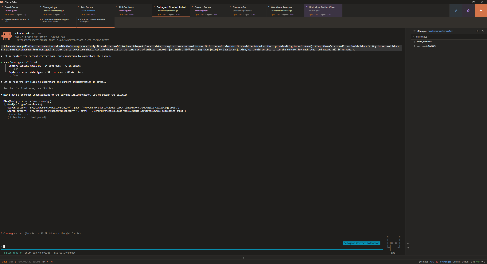

# Code Tabs

A desktop app for managing Claude Code and OpenAI Codex CLI sessions in tabs. Rust backend, React/TypeScript frontend, no API key required — uses your installed CLI directly.



## Features

- **Multiple coding-agent sessions in tabs** — Run Claude Code and Codex sessions side by side with fixed-width tabs, drag-to-reorder, working-directory grouping, and auto-respawn of dead tabs.
- **Subagents as first-class terminals** — Live status bar tracks every nested agent with elapsed time, tokens, and cost; click to open the full inspector with conversation, edits, bash, and file tool calls.
- **First-party Claude Code and Codex support** — Launch either CLI when installed, hide missing-CLI features, and keep slash commands, models, settings, hooks, MCP, and skills scoped to the active ecosystem.
- **Live tok/s, latency, and cost** — EMA-smoothed output throughput, API latency, network RTT, and per-session spend — all derived from TAP events, no terminal polling.
- **Auto-discovers installed CLIs** — Scans Claude Code and Codex for versions, command options, models, slash commands, env hints, settings, skills, and plugins where each ecosystem exposes them.
- **Session resume with chain merging** — Browse past conversations with previews, model badges, and content search; plan-mode forks collapse into a single card and config (model, permissions, effort, budgets, system prompt) is preserved across resumes.
- **Configuration manager (Ctrl+,)** — Modal covering settings, env vars, instructions, hooks, plugins, agents, prompts, skills, providers, and recording, editable across User / Project / Project Local scopes with non-destructive saves.
- **Visual CLI launcher** — Installed CLI flags as clickable pills with live command preview; quick-launch (Ctrl+Shift+T) bypasses the modal using saved defaults.
- **Command bar with usage heat** — Slash commands ranked by how rarely you use them (green → blue → purple → orange), click to type, Ctrl+click to send, per-session history strip.
- **Activity panel** — File tree of everything the agent touched this response, with a floating mascot that tracks the main agent and pinned markers for each subagent at their last edit site.
- **Cross-session terminal search (Ctrl+Shift+F)** — Regex search across every live terminal buffer with a 500-result cap.
- **System prompt / context viewer** — Inspect captured system prompt blocks with token stats and cache-boundary markers.
- **TAP event pipeline** — Push-based TCP socket receives raw entries, a classifier produces ~45 typed events across 22 flag-gated categories; state is derived from events, not terminal scraping.
- **API proxy with request compression** — Rewrites bash, grep, glob, and JSON request bodies to trim token usage before they hit the wire; tracks per-rule match counts.
- **Desktop notifications with click-to-focus** — Rate-limited WinRT toasts on response complete, permission needed, or error; clicking jumps to the source tab.
- **WebGL terminal** — 1M fixed scrollback, DEC 2026 synchronized output, batch-debounced writes, OSC 52 clipboard-hijack stripping, and scroll-to-last-message via prompt-marker detection.

## Install

Download the latest `.exe` from [Releases](../../releases) or build from source:

```bash
npm install
npm run tauri build
```

The installer is at `src-tauri/target/release/bundle/nsis/`.

Or run the portable exe directly from `src-tauri/target/release/`.

### Requirements

- Windows 10 (21H2+) or Windows 11
- [Claude Code CLI](https://docs.anthropic.com/en/docs/claude-code/overview) or [OpenAI Codex CLI](https://developers.openai.com/codex/cli) installed and authenticated
- WebView2 runtime (pre-installed on Windows 11)

## Development

```bash
npm run tauri dev        # Dev mode with hot-reload
npx tsc --noEmit         # Type-check
npm test                 # Unit tests (Vitest)
npm run build:quick      # Quick build (no NSIS installer)
npm run build:debug      # Debug build (no NSIS installer)
```

## Keyboard Shortcuts

| Shortcut | Action |
|----------|--------|
| Ctrl+T | New session |
| Ctrl+Shift+T | Quick launch (saved defaults) |
| Ctrl+W | Close active tab |
| Ctrl+Tab / Ctrl+Shift+Tab | Cycle tabs (skips dead) |
| Alt+1-9 | Jump to tab N |
| Ctrl+K | Command palette |
| Ctrl+, | Configuration manager |
| Ctrl+Shift+R | Resume past session |
| Ctrl+Shift+F | Cross-session terminal search |
| Ctrl+Home / Ctrl+End | Scroll to top / bottom |
| Ctrl+Wheel | Snap to top / bottom |
| Ctrl+Middle-click | Scroll to last message |
| Shift+Click tab | Relaunch with new options |
| Right-click tab | Context menu (copy ID, rename, etc.) |
| Escape | Dismiss (ordered: context menu, palette, side panel, config, resume, launcher, inspector) |

Activity, Search, and Debug views are tabs in the right panel — click to switch, or hit Ctrl+Shift+F to jump straight to Search.

## Architecture

```
React 19 + TypeScript (WebView2)
  |
  Tauri v2 IPC
  |
  Rust Backend
  |-- ConPTY / openpty --> Claude Code CLI / Codex CLI
  |-- TAP TCP socket <-- Inspector events
  |-- API proxy --> Provider routing
  |-- WinRT toast notifications
```

Built with [Tauri v2](https://tauri.app), [xterm.js 6](https://xtermjs.org), [Zustand](https://github.com/pmndrs/zustand), and [React 19](https://react.dev).

## License

MIT
